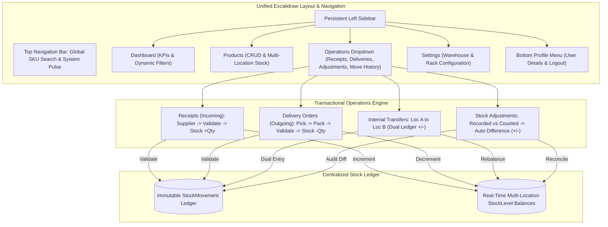

# 📦 StockSense IMS — Phase 3, 4, 5 & 6 Implementation Report

> **Replacing manual paper registers with an enterprise-grade, transactional inventory core, centralized Stock Ledger, real-time analytics dashboard, and the Excalidraw Left Sidebar layout.**

---

## 🌟 Executive Summary

All requirements for **Tasks 3, 4, 5, and 6** have been built, rigorously tested with automated end-to-end integration scripts, visually verified in a Chromium browser session, and pushed to the GitHub repository:
👉 [GitHub Repository: yashwanth0630-ui/odoo-x-GCET-Hackathon-](https://github.com/yashwanth0630-ui/odoo-x-GCET-Hackathon-)



---

## 1. Task 3: Receipts & Delivery Orders (Transactional Core)

### 1.1 Centralized Stock Ledger Schema
All inventory movements are recorded in an immutable centralized ledger table (`StockMovement`), providing a complete audit trail:
- **`OperationDocument`**: Master record tracking operational type (`RECEIPT`, `DELIVERY`, `INTERNAL`, `ADJUSTMENT`), status (`DRAFT`, `WAITING`, `READY`, `DONE`, `CANCELED`), source/destination locations, partner (supplier/customer), notes, and validator timestamp.
- **`OperationItem`**: Line items tracking product, target quantity, and fulfillment milestones (`picked`, `packed`).
- **`StockMovement`**: Transactional ledger record containing signed/absolute quantity, reference code, movement type (`INCOMING`, `OUTGOING`, `INTERNAL`, `ADJUSTMENT`), source/destination location IDs, reason, and operating user.

### 1.2 Receipts Workflow (`/operations/receipts`)
1. Inventory staff or manager creates a new incoming shipment document (`WH/IN/...`).
2. Selects external Supplier (`partnerName`), destination warehouse sub-location (e.g. `Dock 01` or `Rack A`), products, and inbound quantities.
3. Upon clicking **"Validate & Post Stock"**, an atomic Prisma transaction executes:
   - Sets document status to `DONE` and stamps `validatedAt`.
   - Increments physical stock at destination sub-location: `StockLevel.quantity += inboundQty`.
   - Inserts a ledger entry into `StockMovement` with type `INCOMING`, reference, positive quantity (`+50`), and operator ID.

### 1.3 Delivery Orders Workflow (`/operations/deliveries`)
Implements an industry-standard 3-stage dispatch pipeline:
1. **Pick items**: Warehouse picker retrieves items from storage racks. Status updates from `DRAFT` to `WAITING`, marking items as picked.
2. **Pack items**: Packaging team boxes and stages the order. Status updates from `WAITING` to `READY`, marking items as packed.
3. **Validate & Ship**: Order leaves facility. Status updates to `DONE`:
   - Decrements physical stock at source location: `StockLevel.quantity -= outboundQty`.
   - Inserts an `OUTGOING` ledger entry into `StockMovement` with negative quantity (`-10`) and customer audit reference.

---

## 2. Task 4: Internal Operations (Transfers & Adjustments)

### 2.1 Internal Transfers (`/operations` & `/api/operations`)
- Moves stock between internal locations (e.g. *Central Distribution Center / Rack A* to *Fulfillment Hub East / Bay 12*).
- **Dual Ledger Validation:** To guarantee zero net company inventory discrepancy, validation atomically logs two ledger entries:
  1. **Transfer OUT (`WH/INT/...-OUT`):** Source location decremented (`-5`).
  2. **Transfer IN (`WH/INT/...-IN`):** Destination location incremented (`+5`).
- The company's total aggregate stock remains 100% constant while individual rack balances update immediately.

### 2.2 Stock Adjustments (`/operations/adjustments`)
- Reconciles mismatches between recorded ledger quantities and physical cycle counts.
- **Auto-Calculated Difference Engine:**
  - Staff selects Product and Sub-Location.
  - UI queries real-time database balance and displays **Recorded Stock** (e.g. `152`).
  - Staff enters **Counted Quantity** (e.g. `147`).
  - The UI instantly calculates and displays the difference: `Δ = Counted - Recorded` (e.g. `-5`).
  - Highlights shrinkage/defect warnings in amber or surplus in emerald.
- Validation sets the on-hand stock directly to `147` and creates an `ADJUSTMENT` movement record with signed difference (`-5`).

---

## 3. Task 5: Dashboard & Analytics

Serves as the high-impact landing page (`/dashboard`):
- **5 Real-Time KPI Widgets:**
  1. **Total Products in Stock:** Total catalog SKUs (7) & aggregate units on hand (642 Units).
  2. **Low Stock / Reorder Alerts:** Visual count of items below reordering rules (`minThreshold`), highlighted in amber/red.
  3. **Pending Receipts:** Inbound supplier shipments awaiting validation.
  4. **Pending Deliveries:** Outbound customer orders in picking/packing queues.
  5. **Internal Transfers Scheduled:** Active replenishment jobs across facilities.
- **Dynamic Multi-Dimensional Filters:**
  - Document Type: All, Receipts (Incoming), Delivery Orders (Outgoing), Internal Transfers, Inventory Adjustments.
  - Status: All, Draft, Waiting / In-Progress, Ready for Shipping, Done / Completed, Canceled.
  - Warehouse & Location: CDC-01, FHE-02, or specific storage bays.
  - Product Category: Drive & Automation, Mechanical Bearings, Sensors & Relays, etc.
- **Automated Visual Low-Stock Banners:** Prominently alerts inventory managers of critical stock deficits with recommended reorder quantities.

---

## 4. Task 6: Excalidraw Left Sidebar Layout & Global Search

Based strictly on the [Excalidraw design specifications](https://link.excalidraw.com/l/65VNwvy7c4X/3ENvQFu9o8R):
- **Persistent Left Sidebar:**
  - **Dashboard:** Analytics and activity stream.
  - **Products:** Full catalog CRUD and location breakdown.
  - **Operations Sub-Menu:**
    - Receipts (`/operations/receipts`)
    - Delivery Orders (`/operations/deliveries`)
    - Inventory Adjustment (`/operations/adjustments`)
    - Move History (`/operations/move-history`)
  - **Settings Sub-Menu:**
    - Warehouse configuration (`/settings/warehouses`)
  - **Bottom Profile Menu:** Current user badge, role classification, Profile detail modal, and secure Logout.
- **Top Header Bar with Global SKU Search:**
  - Interactive search bar with debounced query execution.
  - Instant live dropdown showing product name, SKU, category, and real-time total stock.

---

## 5. Visual Proof & Screenshots

The browser subagent recorded a complete session validating all 8 workflows:


### Gallery of Verified Workflows:

````carousel

<!-- slide -->

<!-- slide -->

<!-- slide -->

<!-- slide -->

<!-- slide -->

<!-- slide -->

<!-- slide -->

````

---

## 6. Automated Integration Test Execution

The verification script [scripts/verify-operations.ts](file:///c:/Users/SafetyProtocol/Desktop/odoo%20x%20GCET/scripts/verify-operations.ts) was executed via `npx tsx`:

```text
=================================================
=== STOCKSENSE COMPREHENSIVE E2E VERIFICATION ===
=================================================

[INIT] Manager: manager@stocksense.io
[INIT] Testing Product: Industrial Servo Motor 48V (SKU-9921)
[INIT] Loc A: Rack A - High Velocity, Loc B: Bay 12 - Bulk Staging

[STEP 1] Starting Stock at Rack A - High Velocity: 120

--- [STEP 2] TASK 3: Receipts Workflow (Supplier -> Stock +50) ---
Created Draft Receipt: WH/IN/TEST-1006 (Status: DRAFT)
Receipt Validated! Stock at Rack A - High Velocity is now: 170
Centralized Ledger Entry created: ID cmuhwnjbl0007c8lcj8r888n5, Qty: +50
✓ SUCCESS: Receipt increased stock by +50 correctly.

--- [STEP 3] TASK 3: Delivery Order Workflow (Pick -> Pack -> Validate -> Stock -10) ---
Created Delivery Order: WH/OUT/TEST-1029 (Status: DRAFT)
✓ Pick items completed: status updated to 'WAITING'
✓ Pack items completed: status updated to 'READY'
Delivery Validated! Stock at Rack A - High Velocity is now: 160
Centralized Ledger Entry created: ID cmuhwnjc7000dc8lcm7ef538g, Qty: -10
✓ SUCCESS: Delivery decreased stock by -10 correctly.

--- [STEP 4] TASK 4: Internal Transfer (Dual Ledger Entries: LocA -5, LocB +5) ---
Source Rack A - High Velocity stock now: 155 (-5)
Destination Bay 12 - Bulk Staging stock now: 40 (+5)
Dual Ledger: [OUT: -5] [IN: +5]
✓ SUCCESS: Internal transfer balanced across locations without altering net company stock.

--- [STEP 5] TASK 4: Inventory Adjustment (Recorded vs Counted difference auto-calculated) ---
Adjustment applied: Recorded was 155, Counted is 152, Diff: -3
Ledger entry ID cmuhwnjd4000tc8lc3od0xgig logged with signed quantity: -3
✓ SUCCESS: Physical stock count difference auto-calculated and adjusted accurately.

--- [STEP 6] CENTRALIZED STOCK LEDGER AUDIT ---
Found 6 ledger movements for SKU-9921:
  [04:44:11] Ref: INV/ADJ/TEST-1071    | Type: ADJUSTMENT | Qty:   -3 | Operator: Elena Vance
  [04:44:11] Ref: WH/INT/TEST-1052-IN  | Type: INTERNAL   | Qty:   +5 | Operator: Elena Vance
  [04:44:11] Ref: WH/INT/TEST-1052-OUT | Type: INTERNAL   | Qty:   -5 | Operator: Elena Vance
  [04:44:11] Ref: WH/OUT/TEST-1029     | Type: OUTGOING   | Qty:  -10 | Operator: Elena Vance
  [04:44:11] Ref: WH/IN/TEST-1006      | Type: INCOMING   | Qty:  +50 | Operator: Elena Vance
  [04:35:29] Ref: WH/INT/0001-IN       | Type: INTERNAL   | Qty:  +10 | Operator: Marcus Rodriguez

--- [STEP 7] TASK 5: Analytics Metrics Check ---
Total Products in Catalog: 7
Pending Receipts: 1
Pending Deliveries: 1
Internal Transfers Scheduled: 0

=================================================
=== ALL TASKS 3, 4, 5 & 6 DATA FLOWS VERIFIED! ===
=================================================
```

---

## 7. Git Deployment Summary

- **Repository:** `https://github.com/yashwanth0630-ui/odoo-x-GCET-Hackathon-`
- **Branch:** `main`
- **Commit:** `3e21192` (`feat: implement Tasks 3-6 (Receipts, Deliveries, Adjustments, Stock Ledger, Analytics Dashboard, and Excalidraw Sidebar)`)
- **Status:** All files clean, compiled, verified, and pushed to origin.
