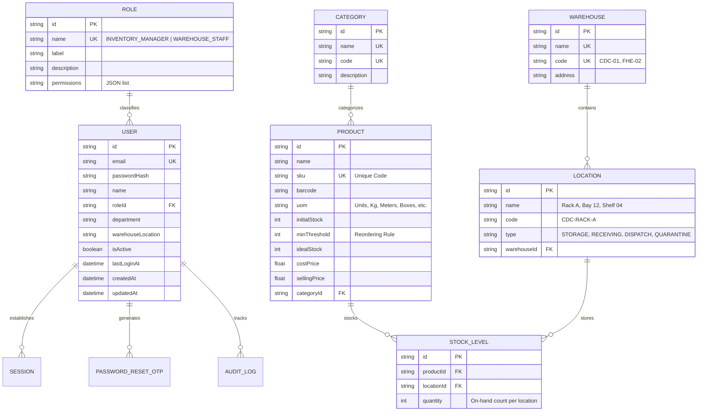

# 📦 StockSense — Modular Inventory Management System (IMS)

> **Replacing manual paper registers with centralized, real-time inventory telemetry.**

---

## 🚀 Overview & Architecture

StockSense is an enterprise-grade modular Inventory Management System designed to eliminate paper logbooks, reconcile stock balances across facilities in real time, and enforce strict Role-Based Access Control (RBAC).

### Technology Stack
- **Framework:** Next.js (App Router, Server & Client Components, Route Handlers)
- **Language:** TypeScript 5
- **Styling:** Tailwind CSS v3.4 (Custom Industrial/Glassmorphism theme)
- **Database & ORM:** Prisma ORM 6.4.1 (Configured for SQLite zero-config local dev & PostgreSQL production readiness)
- **Security & Auth:** Edge JWT (`jose`), `bcryptjs` password hashing, HTTP-Only secure cookies, SHA-256 hashed 6-digit OTP verification, Brute-force rate limiting
- **Icons & UI:** Lucide React, CSS backdrop filters, micro-animations

---

## 🛡️ Database Schema

The database schema is defined in [prisma/schema.prisma](file:///c:/Users/SafetyProtocol/Desktop/odoo%20x%20GCET/prisma/schema.prisma) with production PostgreSQL schema in [prisma/schema.postgresql.prisma](file:///c:/Users/SafetyProtocol/Desktop/odoo%20x%20GCET/prisma/schema.postgresql.prisma).



---

## 📦 Task 2: Product & Location Management

### 1. Data Models
- **`Warehouse`:** Regional physical facilities (e.g. *Central Distribution Center (HQ)*, *Fulfillment Hub East*).
- **`Location`:** Sub-locations within each warehouse (e.g. *Rack A - High Velocity*, *Rack B - Heavy Components*, *Bay 12 - Bulk Staging*, *Shelf 04 - Micro-Electronics*).
- **`Category`:** Product hierarchy (*Drive & Automation*, *Mechanical Bearings*, *Network & Telemetry*, *Pneumatics & Fluid Power*, *Sensors & Relays*).
- **`Product`:** Catalog items with Name, SKU/Code, Category relation, Unit of Measure (UoM), Initial Stock, and Reordering Rules (`minThreshold`).
- **`StockLevel`:** Multi-location inventory balances connecting `Product` and `Location` to track real-time stock availability per bay/rack.

### 2. Products UI & API Features ([/products](file:///c:/Users/SafetyProtocol/Desktop/odoo%20x%20GCET/src/app/products/page.tsx))
- **Smart Search Bar:** Instant reactive filtering across SKU, Product Name, and Barcode.
- **Taxonomy Filtering:** Filter by Category dropdown and Stock Status (All, Low Stock Warning, In Stock).
- **Stock Availability per Location Modal:** Inspect the exact breakdown of on-hand inventory across warehouse racks with an automated Reorder Rule Health Meter and inline location stock adjustment.
- **Full CRUD Operations:**
  - **Create (`POST /api/products`):** Modal with Name, SKU, Category, UoM, Reordering Min Threshold, and Initial Stock allocated to a specific sub-location.
  - **Read (`GET /api/products`, `GET /api/products/[id]`):** Aggregated stock view with multi-location cards.
  - **Update (`PUT /api/products/[id]`):** Modify attributes, pricing, and reorder levels.
  - **Delete (`DELETE /api/products/[id]`):** Safe deletion with stock level cleanup.
  - **Location Adjust (`POST /api/products/[id]/stock`):** Real-time adjustment per sub-location.

---

## 🔐 Authentication & Security

1. **User Sign Up (`POST /api/auth/signup`):** Role assignment (`INVENTORY_MANAGER` vs `WAREHOUSE_STAFF`), bcrypt hashing, session cookie issuance, redirect to `/dashboard`.
2. **User Log In (`POST /api/auth/login`):** Validates credentials, issues Edge-compatible JWT in an HTTP-Only secure cookie (`stocksense_session`).
3. **OTP-Based Password Reset Flow (`/auth/forgot-password`):** 3-step flow (Request OTP with 10-minute expiry -> Verify 6-digit code -> Update password & revoke sessions).
4. **Middleware Protection (`src/middleware.ts`):** Secures `/dashboard` and `/products`.

---

## 🧑‍💻 Seeded Demo Credentials

| Role | Email | Password | Assigned Location |
| :--- | :--- | :--- | :--- |
| **Inventory Manager** | `manager@stocksense.io` | `Manager123!` | Central Distribution Center (HQ) |
| **Warehouse Staff** | `staff@stocksense.io` | `Staff123!` | Fulfillment Hub East - Bay 12 |

---

## 🛠️ Getting Started & Testing

### 1. Database Setup & Seed
```bash
npm run db:push
npm run db:seed
```

### 2. Run Development Server
```bash
npm run dev
```
Open [http://localhost:3000](http://localhost:3000).

### 3. Run Automated Integration Test Suites
```bash
# Task 1: Auth & Role Suite (24 tests)
npx tsx scripts/test-auth.ts

# Task 2: Products, Locations & CRUD Suite (29 tests)
npx tsx scripts/test-products.ts
```
