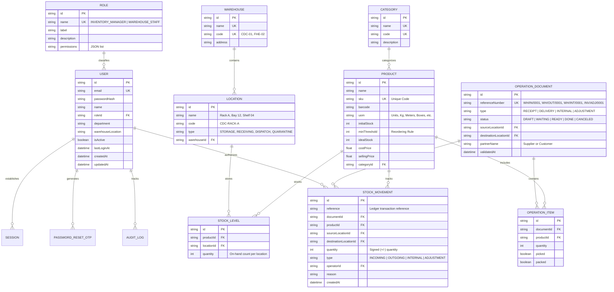

# 📦 StockSense — Modular Inventory Management System (IMS)

> **Replacing manual paper registers with centralized, real-time inventory telemetry.**

---

## 🚀 Overview & Architecture

StockSense is an enterprise-grade modular Inventory Management System designed to eliminate paper logbooks, reconcile stock balances across facilities in real time, and enforce strict Role-Based Access Control (RBAC).

### Technology Stack
- **Framework:** Next.js (App Router, Server & Client Components, Route Handlers)
- **Language:** TypeScript 5
- **Styling:** Tailwind CSS v3.4 (Custom Industrial/Glassmorphism theme)
- **Database & ORM:** Prisma ORM 6.4.1 (Configured for SQLite zero-config local dev & PostgreSQL production readiness)
- **Security & Auth:** Edge JWT (`jose`), `bcryptjs` password hashing, HTTP-Only secure cookies, SHA-256 hashed 6-digit OTP verification, Brute-force rate limiting
- **Icons & UI:** Lucide React, CSS backdrop filters, micro-animations

---

## 🛡️ Database Schema

The database schema is defined in [prisma/schema.prisma](file:///c:/Users/SafetyProtocol/Desktop/odoo%20x%20GCET/prisma/schema.prisma) with production PostgreSQL schema in [prisma/schema.postgresql.prisma](file:///c:/Users/SafetyProtocol/Desktop/odoo%20x%20GCET/prisma/schema.postgresql.prisma).



---

## 📦 Task 2: Product & Location Management

### 1. Data Models
- **`Warehouse`:** Regional physical facilities (e.g. *Central Distribution Center (HQ)*, *Fulfillment Hub East*).
- **`Location`:** Sub-locations within each warehouse (e.g. *Rack A - High Velocity*, *Rack B - Heavy Components*, *Bay 12 - Bulk Staging*, *Shelf 04 - Micro-Electronics*).
- **`Category`:** Product hierarchy (*Drive & Automation*, *Mechanical Bearings*, *Network & Telemetry*, *Pneumatics & Fluid Power*, *Sensors & Relays*).
- **`Product`:** Catalog items with Name, SKU/Code, Category relation, Unit of Measure (UoM), Initial Stock, and Reordering Rules (`minThreshold`).
- **`StockLevel`:** Multi-location inventory balances connecting `Product` and `Location` to track real-time stock availability per bay/rack.

### 2. Products UI & API Features ([/products](file:///c:/Users/SafetyProtocol/Desktop/odoo%20x%20GCET/src/app/products/page.tsx))
- **Smart Search Bar:** Instant reactive filtering across SKU, Product Name, and Barcode.
- **Taxonomy Filtering:** Filter by Category dropdown and Stock Status (All, Low Stock Warning, In Stock).
- **Stock Availability per Location Modal:** Inspect the exact breakdown of on-hand inventory across warehouse racks with an automated Reorder Rule Health Meter and inline location stock adjustment.
- **Full CRUD Operations:** Create, Read, Update, Delete products with live stock allocation.

---

## 🚚 Task 3: Receipts & Delivery Orders (Transactional Core)

- **Centralized Stock Ledger:** All stock movements are immutably logged in the `StockMovement` table.
- **Receipts (Incoming Goods - `/operations/receipts`):**
  - Workflow: Create new receipt -> select Supplier and products -> input quantities -> click **'Validate'**.
  - Validation Transaction: Atomically updates document status to `DONE`, increments physical stock at destination sub-location, and inserts an `INCOMING` ledger movement with positive quantity (`+50`).
- **Delivery Orders (Outgoing Goods - `/operations/deliveries`):**
  - Workflow: Step-by-step picking and packing pipeline:
    1. **Pick items** -> status transitions to `WAITING` (goods retrieved from rack).
    2. **Pack items** -> status transitions to `READY` (goods packaged and staged).
    3. **Validate & Ship** -> status transitions to `DONE`, decrements stock at source sub-location, and inserts an `OUTGOING` ledger record with negative quantity (`-10`).

---

## 🔄 Task 4: Internal Operations (Transfers & Adjustments)

- **Internal Transfers (`/operations` & `/api/operations`):**
  - Move inventory between internal locations (e.g., Central HQ / Rack A to Production Buffer / Bay 12).
  - **Dual Ledger Validation:** Simultaneously creates an `OUT` ledger entry (`-qty` at source) and an `IN` ledger entry (`+qty` at destination), keeping the net company stock completely unchanged while updating location-level balances.
- **Stock Adjustments (`/operations/adjustments`):**
  - Resolve mismatches between recorded ledger counts and physical stock audits.
  - User selects Product and Location -> UI auto-retrieves current recorded stock -> User inputs **Counted Quantity** -> System auto-calculates difference `delta = counted - recorded` (positive or negative).
  - Upon submission, upserts stock to the counted balance and logs an `ADJUSTMENT` signed ledger entry.

---

## 📊 Task 5: Inventory Dashboard & Analytics

Serves as the high-impact landing page ([/dashboard](file:///c:/Users/SafetyProtocol/Desktop/odoo%20x%20GCET/src/app/dashboard/page.tsx)) after login:
- **5 Real-Time KPI Widgets:**
  1. *Total Products in Stock*: Aggregate count of active SKUs and total company-wide units.
  2. *Low Stock / Out of Stock Items*: Real-time audit of SKUs breaching minimum reordering rules.
  3. *Pending Receipts*: Inbound vendor shipments awaiting arrival and validation.
  4. *Pending Deliveries*: Outbound customer orders in draft, picking, or packing stages.
  5. *Internal Transfers Scheduled*: Warehouse relocations and replenishment orders queued.
- **Dynamic Multi-Dimensional Filters:** Filter operational activities and recent feeds by:
  - Document Type (`Receipts`, `Delivery`, `Internal Transfers`, `Adjustments`)
  - Status (`Draft`, `Waiting`, `Ready`, `Done`, `Canceled`)
  - Warehouse or Location
  - Product Category
- **Automated Visual Low-Stock Alerts:** Prominent alert banners and red/amber badges showing reorder deficits and suggestions.

---

## 🧭 Task 6: Excalidraw Navigation, Layout & Polish

Strictly modeled after the [Excalidraw layout design](https://link.excalidraw.com/l/65VNwvy7c4X/3ENvQFu9o8R):
- **Persistent Left Sidebar:**
  - **Dashboard:** Direct route to analytics and filtered operations.
  - **Products:** Product catalog, taxonomy, and multi-location balances.
  - **Operations Dropdown / Sub-menu:**
    - Receipts (`/operations/receipts`)
    - Delivery Orders (`/operations/deliveries`)
    - Inventory Adjustment (`/operations/adjustments`)
    - Move History (`/operations/move-history`)
  - **Settings Dropdown / Sub-menu:**
    - Warehouse Configuration (`/settings/warehouses`)
  - **Bottom Profile Menu:** Current user badge (`Elena Vance`, `INVENTORY_MANAGER`), `My Profile` details modal, and secure `Logout`.
- **Top Header Bar with Global SKU Search:**
  - Fast, debounced SKU and product search with live interactive dropdown modal for quick navigation.
- **Responsive Industrial Design:** Dark industrial aesthetic, glassmorphism panels, mobile slide-over drawer, and tabular replacement for legacy Excel spreadsheets.

---

## 🧑‍💻 Seeded Demo Credentials

| Role | Email | Password | Assigned Location |
| :--- | :--- | :--- | :--- |
| **Inventory Manager** | `manager@stocksense.io` | `Manager123!` | Central Distribution Center (HQ) |
| **Warehouse Staff** | `staff@stocksense.io` | `Staff123!` | Fulfillment Hub East - Bay 12 |

---

## 🛠️ Getting Started & Testing

### 1. Database Setup & Seed
```bash
npm run db:push
npm run db:seed
```

### 2. Run Development Server
```bash
npm run dev
```
Open [http://localhost:3000](http://localhost:3000).

### 3. Run Automated Integration Test Suites
```bash
# Task 1: Auth & Role Suite (24 tests)
npx tsx scripts/test-auth.ts

# Task 2: Products, Locations & CRUD Suite (29 tests)
npx tsx scripts/test-products.ts

# Tasks 3-6: Operations, Stock Ledger & Analytics Verification Suite
npx tsx scripts/verify-operations.ts
```
